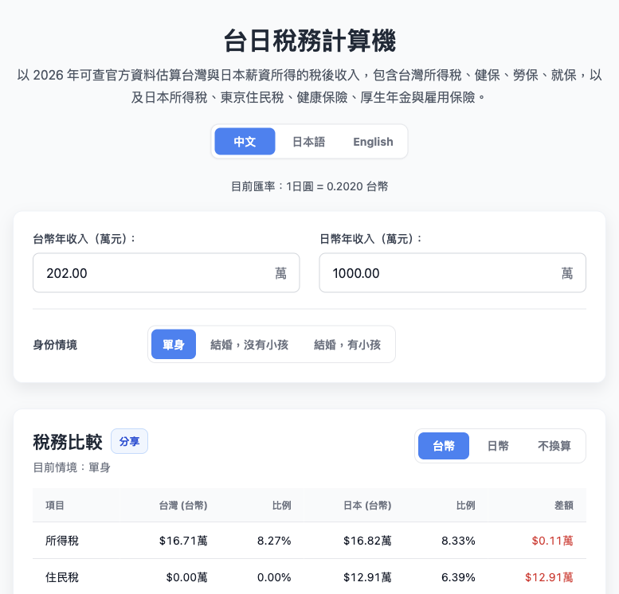

# 台日稅務比較計算器



一個簡單的台灣 / 日本薪資稅務比較工具，用 2026 年可查的官方資料估算兩地薪資所得的稅後收入、所得稅、社會保險與總稅金差異。

網站主版本是繁體中文，另外提供英文與日文頁面：

- `index.html`：繁體中文
- `en.html`：英文
- `ja.html`：日文

## 功能

- 比較台灣與日本薪資所得的稅後收入。
- 支援三種身份情境：單身、結婚沒小孩、結婚有小孩。
- 支援比較幣值切換：台幣、日幣、不換算。
- 台灣計算包含所得稅、健保、勞保、就業保險。
- 日本計算包含所得稅、復興特別所得稅、東京住民稅、健康保險、厚生年金、雇用保險。
- 稅務結果可開啟詳細計算過程。
- 遇到所得稅、投保金額、標準報酬月額等級距資料時，可另外查看級距表並 highlight 目前套用的級距。
- 內建官方資料來源清單。
- 產出 SEO 與 AI crawler 輔助檔案：`sitemap.xml`、`robots.txt`、`llms.txt`、`zh-TW.md`、`en.md`、`ja.md`。

## 使用方式

直接打開 `index.html` 就能使用。若要用本地 server：

```bash
npm run dev
```

預設會開在：

```text
http://localhost:8000/
```

建置三語 HTML 與 SEO/AI 摘要檔：

```bash
npm run build
```

## 專案結構

- `src/template.html`：三語頁面的 HTML template。
- `translations.json`：繁體中文、英文、日文翻譯文字。
- `tax-rules.js`：台灣與日本稅務、保險、年金公式與官方來源。
- `script.js`：UI 互動、圖表、modal、幣值切換與計算渲染。
- `styles.css`：頁面樣式。
- `build.js`：產出 `index.html`、`en.html`、`ja.html`、Markdown 摘要、`sitemap.xml`、`robots.txt`、`llms.txt`。
- `dev.js`：簡單本地開發 server，會 watch template、翻譯、公式與 build 腳本。

## 主要假設

- 此工具用於一般薪資所得比較，不涵蓋租金、投資、海外所得、長照、身障、醫療、保險列舉扣除等個人特殊條件。
- 配偶假設無收入。
- 身份情境只用於稅務條件，例如免稅額、標準扣除、幼兒扣除、基本生活費或配偶控除。
- 台灣健保只計算本人保費，不把眷屬加保費算進比較，避免和日本本人薪資扣款比較時失衡。
- 日本地區固定使用東京；住民稅與健康保險不提供其他都道府縣選項。
- 日本納稅人假設未滿 40 歲，因此不計介護保險。
- 日本健康保險與厚生年金在月收入低於 88,000 日圓時，本模型視為未達短時間勞工適用門檻；雇用保險仍依薪資與費率估算。
- 實際稅額仍以主管機關、公司投保方式與個人申報條件為準，本工具不是稅務、法律、財務或移民建議。

## 資料來源

資料以 2026 年可查官方資料為準。

### 台灣

- [財政部：114 年度綜合所得稅免稅額、扣除額與課稅級距](https://www.mof.gov.tw/singlehtml/384fb3077bb349ea973e7fc6f13b6974?cntId=e6bfc90ed42e42ccbcd83be96e331afc)
- [財政部：114 年度每人基本生活所需費用](https://www.dot.gov.tw/singlehtml/ch26?cntId=7e174aba28b34a4b8df93cadadef6ec9)
- [衛生福利部中央健康保險署：一般保險費計算公式](https://www.nhi.gov.tw/ch/cp-3277-6c895-2588-1.html)
- [衛生福利部中央健康保險署：部分工時與受僱者加保規則](https://www.nhi.gov.tw/ch/cp-7678-9b5bd-3255-1.html)
- [衛生福利部中央健康保險署：115 年 1 月 1 日起投保金額分級表](https://www.nhi.gov.tw/ch/cp-19421-f9533-2569-1.html)
- [勞動部勞工保險局：勞工保險保險費率與負擔比例](https://www.bli.gov.tw/0005478.htm)
- [勞動部勞工保險局：勞工保險投保薪資分級表](https://www.bli.gov.tw/0100493.html)
- [勞動部勞工保險局：部分工時勞工投保薪資與加保說明](https://www.bli.gov.tw/0006920.html)
- [勞動部勞工保險局：就業保險保險費](https://www.bli.gov.tw/0006443.html)

### 日本

- [國稅廳：所得稅稅率速算表](https://www.nta.go.jp/taxes/shiraberu/taxanswer/shotoku/2260.htm?ts=20220101111633)
- [國稅廳：基礎控除](https://www.nta.go.jp/taxes/shiraberu/taxanswer/shotoku/1199.htm)
- [國稅廳：令和 7 年度稅制改正與給与所得控除](https://www.nta.go.jp/users/gensen/2025kiso/index.htm?s=09)
- [東京都主税局：個人住民税](https://www.tax.metro.tokyo.lg.jp/kazei/kojin_ju.html?referral=a8)
- [全國健康保險協會：令和 8 年度都道府縣保險料率](https://www.kyoukaikenpo.or.jp/about/business/insurance_rate/rate_prefectures/r08/index.html)
- [全國健康保險協會：令和 8 年度保險料額表](https://www.kyoukaikenpo.or.jp/about/business/insurance_rate/premium_prefectures/r08/index.html)
- [厚生勞動省：短時間勞工社會保險適用擴大 Q&A](https://www.mhlw.go.jp/tekiyoukakudai/qa/)
- [厚生勞動省：令和 8 年短時間勞工社會保險賃金要件說明](https://www.mhlw.go.jp/content/12500000/001633788.pdf)
- [日本年金機構：厚生年金保險料額表](https://www.nenkin.go.jp/service/kounen/hokenryo/hoshu/20150515-01.html)
- [厚生勞動省：令和 8 年度雇用保險料率](https://www.mhlw.go.jp/content/001692566.pdf)

## 驗證

目前建議的基本檢查：

```bash
node --check script.js
node --check build.js
node --check dev.js
node --check tax-rules.js
npm run build
```
